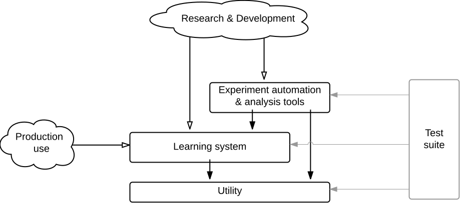

# Reinforcement Learning Components for Control toolbox

Language: Matlab & C++

The Reinforcement Learning Components for Control toolbox contains high-performance implementations of several reinforcement learning algorithms and some commonly used benchmark problems. The policy improvement algorithms are implemented in a unifying manner (cf. Wagner, 2013). All elements are solidly integrated within an experiment automation and analysis framework with cluster parallelization support.

Policy improvement algorithms:
- Forgetful natural actor-critic (Wagner, 2013), which generalizes the following algorithm families:
  - Natural actor-critic (Peters, 2007)
  - Optimistic soft-greedy policy iteration (e.g., Bertsekas, 2011)

Legacy policy improvement algorithms (might need tweaking to run with the latest toolbox version):
- On-line greedy iteration with TD evaluation (implements Q-learning and SARSA)
- Least-squares policy iteration (on-policy) (Lagoudakis & Parr, 2003)
- Least-squares λ-policy iteration (e.g., Bertsekas, 2015)

Policy evaluation algorithms:
- Least-squares policy evaluation / LSPE(λ)   (Nedic & Bertsekas, 2003)
- Least-squares temporal difference learning / LSTD(λ)   (Nedic & Bertsekas, 2003; Boyan, 2002)

Environments:
- The Tetris benchmark with standard features (cf. Bertsekas & Ioffe, 1996)
- Graph environments from (Wagner, 2010, 2011, 2013, 2014)
- Discretized metric POMDP synthesizer
- Discrete single and double integrator grid-worlds
- Discrete-to-continuous environment wrapper using synthesized RBFs

Most algorithms support both discrete and continuous observation spaces together with linear function approximation. Continuous action spaces and afterstates are supported via dynamic action lists: on each step, the algorithms accept a dynamically generated list of candidate actions or afterstates, from which they learn to choose.


## Basic usage

Before using the toolbox, you need to first set the paths and compile the mex (C++) files. After this, you might want to run the automated test suite. In Matlab, the following commands accomplish these steps:

```Matlab
    cd <rlcc root directory>
    setpaths
    make
    Tests.Run( 8001 )
```
        
Note that running the entire test suite will take time. The parameter for Run() is a revision number; we just make sure here that it is greater than the revision numbers for which results already exist on disk.


# Documentation



Please see the help sections of the .m files mentioned below for detailed usage instructions.

The core learning system of the toolbox consists of the learning algorithms, environments and the training logic (the **Learning system** in the diagram). This subsystem is enough for manually running single training runs of a given agent and environment. The following source code files and folders under src/ belong to this module:

- Agent.m & agents/
- Environment.m & environments/
- Trainer.m

Experiment automation and analysis tools permit one to automate parts of the typical experimentation workflow during research & development (the **Experiment automation & analysis tools** in the diagram). In particular, testing different parameter values and combinations on a given agent-environment pair can be fully automated and executed in parallel in a computing cluster. Also, convergence curves and other commonly used statistics and plots can be automatically generated from the resulting data. Implementation file:

- Experiment.m

The testing framework (the **Test suite** in the diagram) allows to compare results obtained with new revisions against results from all earlier revisions. Both exact and approximate (stochastic) matching is supported. The testing framework is based on persistent singleton instances of the Tests class and the individual test case classes derived from Test. Implementation folder:

- test/

### The utility layer

The toolbox is built on a cleanly abstracted utility layer (the **Utility** box in the diagram). All implementation files reside in the util/ folder. The major parts of this module include the following abstractions:

_Logging, iterative processes and progress output_: Logging is completely separated from the rest of the toolbox by using the concept of _iterative processes_. In short, everything in the toolbox that requires iteration is implemented using one of the process objects (under util/processes/), which then manage all logging and progress output according to a user-defined logging schema. The logging system permits tapping into all iterative parts in the toolbox, pull data non-invasively from all objects participating in the iterations, filter the data through accumulators to preserve memory and storage space, and provide real-time progress output. Implementation under util/:

- processes/
- Iterative.m
- iterate.m
- Logger.m

_Data persistence_: Provide disk-backed data persistence, especially for the toolbox's test suite. Implementation under util/:

- PersistentSingleton.m

_Shared random stream for Matlab & C++_: Enable deterministically repeatable experiments regardless of the execution back-end. Implementation under util/:

- MexCompatibleRandStream.m

_Object configuration_: Classes can get an inputParser-like interface to their public properties by inheriting from Configurable. This allows setting the public fields of an object by using key/value pairs, with proper type checking. Implementation under util/:

- Configurable.m

Please see the help sections of the .m files mentioned above for detailed usage instructions.


## References

Bertsekas, D. P. (2015). Lambda-policy iteration: A review and a new implementation. _arXiv preprint arXiv:1507.01029._

Bertsekas, D. P. (2011). Approximate policy iteration: A survey and some new methods. _Journal of Control Theory and Applications, 9_(3), 310–335.

Bertsekas, D. P., & Ioffe, S. (1996). Temporal differences-based policy iteration and applications in neuro-dynamic programming. _Lab. for Info. and Decision Systems Report LIDS-P-2349, MIT, Cambridge, MA._

Boyan, J. A. (2002). Technical update: Least-squares temporal difference learning. _Machine Learning, 49_(2), 233-246.

Lagoudakis, M. G., & Parr, R. (2003). Least-squares policy iteration. _Journal of machine learning research, 4_(Dec), 1107-1149.

Nedić, A., & Bertsekas, D. P. (2003). Least squares policy evaluation algorithms with linear function approximation. _Discrete Event Dynamic Systems, 13_(1), 79-110.

Peters, J. R. (2007). Machine learning of motor skills for robotics. _Doctoral dissertation, University of Southern California._

Wagner, P. (2014). Policy oscillation is overshooting. _Neural Networks_, 52, 43-61.

Wagner, P. (2013). Optimistic policy iteration and natural actor-critic: A unifying view and a nonoptimality result. _In Advances in Neural Information Processing Systems_ (pp. 1592-1600).

Wagner, P. (2011). A reinterpretation of the policy oscillation phenomenon in approximate policy iteration. In Advances in Neural Information Processing Systems_ (pp. 2573-2581).

Wagner, P. (2010). On the stability of reinforcement learning under partial observability and generalizing representations. _Master's thesis, Aalto University School of Science and Technology, Department of Information and Computer Science, Espoo, Finland, May 2010._